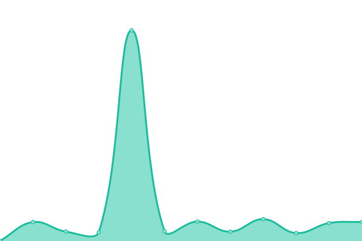

# [📈 Live Status](https://status.cyberflix.io): <!--live status--> **🟧 Partial outage**

This repository contains the open-source uptime monitor and status page for [BobDaGecko](https://status.cyberflix.io), powered by [Upptime](https://github.com/upptime/upptime).

With [Upptime](https://upptime.js.org), you can get your own unlimited and free uptime monitor and status page, powered entirely by a GitHub repository. We use [Issues](https://github.com/BobDaGecko/Cyberflix-Status/issues) as incident reports, [Actions](https://github.com/BobDaGecko/Cyberflix-Status/actions) as uptime monitors, and [Pages](https://status.cyberflix.io) for the status page.

<!--start: status pages-->
<!-- This summary is generated by Upptime (https://github.com/upptime/upptime) -->
<!-- Do not edit this manually, your changes will be overwritten -->
<!-- prettier-ignore -->
| URL | Status | History | Response Time | Uptime |
| --- | ------ | ------- | ------------- | ------ |
|  [Cyberflix Main Site](https://www.cyberflix.io) | 🟩 Up | [cyberflix-main-site.yml](https://github.com/Cyberflix-Media/Cyberflix-Status/commits/HEAD/history/cyberflix-main-site.yml) | 

 299ms
     
 | 

<a href="https://status.cyberflix.io/history/cyberflix-main-site">53.35%</a>
    

|  [Cyberflix Backend](https://backend.cyberflix.io) | 🟩 Up | [cyberflix-backend.yml](https://github.com/Cyberflix-Media/Cyberflix-Status/commits/HEAD/history/cyberflix-backend.yml) | 

 383ms
     
 | 

<a href="https://status.cyberflix.io/history/cyberflix-backend">53.35%</a>
    

|  [Cyberflix Jellyfin](https://watch.cyberflix.io) | 🟩 Up | [cyberflix-jellyfin.yml](https://github.com/Cyberflix-Media/Cyberflix-Status/commits/HEAD/history/cyberflix-jellyfin.yml) | 

 324ms
     
 | 

<a href="https://status.cyberflix.io/history/cyberflix-jellyfin">53.35%</a>
    

|  [Cyberflix Request System](https://requests.cyberflix.io) | 🟩 Up | [cyberflix-request-system.yml](https://github.com/Cyberflix-Media/Cyberflix-Status/commits/HEAD/history/cyberflix-request-system.yml) | 

 436ms
     
 | 

<a href="https://status.cyberflix.io/history/cyberflix-request-system">53.35%</a>
    

|  [Cyberflix Accounts](https://accounts.cyberflix.io) | 🟥 Down | [cyberflix-accounts.yml](https://github.com/Cyberflix-Media/Cyberflix-Status/commits/HEAD/history/cyberflix-accounts.yml) | 

 277ms
     
 | 

<a href="https://status.cyberflix.io/history/cyberflix-accounts">0.00%</a>
    

|  [Cyberflix Speedtest](https://speedtest.cyberflix.io) | 🟩 Up | [cyberflix-speedtest.yml](https://github.com/Cyberflix-Media/Cyberflix-Status/commits/HEAD/history/cyberflix-speedtest.yml) | 

 3329ms
     
 | 

<a href="https://status.cyberflix.io/history/cyberflix-speedtest">53.40%</a>
    

|  [Cyberflix Docs](https://docs.cyberflix.io) | 🟩 Up | [cyberflix-docs.yml](https://github.com/Cyberflix-Media/Cyberflix-Status/commits/HEAD/history/cyberflix-docs.yml) | 

 124ms
     
 | 

<a href="https://status.cyberflix.io/history/cyberflix-docs">100.00%</a>
    

|  [Cyberflix Archive](https://archive.cyberflix.io) | 🟩 Up | [cyberflix-archive.yml](https://github.com/Cyberflix-Media/Cyberflix-Status/commits/HEAD/history/cyberflix-archive.yml) | 

 146ms
     
 | 

<a href="https://status.cyberflix.io/history/cyberflix-archive">100.00%</a>
    

<!--end: status pages-->

[**Visit our status website →**](https://status.cyberflix.io)

## 📄 License

- Powered by: [Upptime](https://github.com/upptime/upptime)
- Code: [MIT](./LICENSE) © [BobDaGecko](https://status.cyberflix.io)
- Data in the `./history` directory: [Open Database License](https://opendatacommons.org/licenses/odbl/1-0/)
